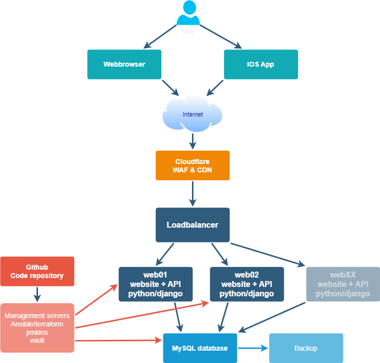

# OurTravels
OurTravels is a website that allows users to save locations they have visited, and get new recommendations of places to visit with their friends.

## Technical Diagram


### Development setup information
MacOS Installation
Brew install: https://brew.sh
```
# brew install mysql pkg-config
# brew services start mysql
# mysql_secure_installation
make sure to set a root password, remove test database and anonymous user
Then setup mysql database and mysql user
# mysql -p
# create database ourtravels;
# CREATE USER 'ourtravels'@'localhost' IDENTIFIED BY 'ourtravels';
# GRANT ALL ON ourtravels.* TO 'ourtravels'@'localhost';
```
After checking out project from github
create python environment (via command palette) and make sure to select requirements.txt for install of dependencies.

in terminal to load python virtual environment, if it doesnt happen automatically
    # source .venv/bin/activate

## Apache config
```
WSGIApplicationGroup %{GLOBAL}
WSGIDaemonProcess ourtravels.ai python-path=/var/www/html/OurTravels/django python-home=/var/www/html/OurTravels/venv
WSGIProcessGroup ourtravels.ai
WSGIScriptAlias / /var/www/html/OurTravels/django/OurTravels/wsgi.py
<VirtualHost *:80>


ServerAdmin admin@ourtravels.ai
ServerName ourtravels.ai
ServerAlias www.ourtravels.ai
DocumentRoot /var/www/html/OurTravels

ErrorLog ${APACHE_LOG_DIR}/ourtravels.ai_error.log
CustomLog ${APACHE_LOG_DIR}/ourtravels.ai_access.log combined

Alias /static /var/www/html/OurTravels/static
<Directory /var/www/html/OurTravels/static>
Require all granted
</Directory>

Alias /media /var/www/html/OurTravels/media
<Directory /var/www/html/OurTravels/media>
Require all granted
</Directory>

<Directory /var/www/html/OurTravels/django/OurTravels>
<Files wsgi.py>
Require all granted
</Files>
</Directory>


RewriteEngine on
RewriteCond %{SERVER_NAME} =www.ourtravels.ai [OR]
RewriteCond %{SERVER_NAME} =ourtravels.ai
RewriteRule ^ https://%{SERVER_NAME}%{REQUEST_URI} [END,NE,R=permanent]
</VirtualHost>
<VirtualHost *:443>


ServerAdmin admin@ourtravels.ai
ServerName ourtravels.ai
ServerAlias www.ourtravels.ai
DocumentRoot /var/www/html/OurTravels

ErrorLog ${APACHE_LOG_DIR}/ourtravels.ai_error.log
CustomLog ${APACHE_LOG_DIR}/ourtravels.ai_access.log combined

Alias /static /var/www/html/OurTravels/static
<Directory /var/www/html/OurTravels/static>
Require all granted
</Directory>

Alias /media /var/www/html/OurTravels/media
<Directory /var/www/html/OurTravels/media>
Require all granted
</Directory>

<Directory /var/www/html/OurTravels/django/OurTravels>
<Files wsgi.py>
Require all granted
</Files>
</Directory>

</VirtualHost>
```
## SSL Certificate installation 
```
sudo apt install certbot python3-certbot-apache
sudo certbot --apache
apache2ctl configtest
```

## Apache config
```
WSGIApplicationGroup %{GLOBAL}
WSGIDaemonProcess ourtravels.ai python-path=/var/www/html/OurTravels/django python-home=/var/www/html/OurTravels/venv
WSGIProcessGroup ourtravels.ai
WSGIScriptAlias / /var/www/html/OurTravels/django/OurTravels/wsgi.py
<VirtualHost *:80>


ServerAdmin admin@ourtravels.ai
ServerName ourtravels.ai
ServerAlias www.ourtravels.ai
DocumentRoot /var/www/html/OurTravels

ErrorLog ${APACHE_LOG_DIR}/ourtravels.ai_error.log
CustomLog ${APACHE_LOG_DIR}/ourtravels.ai_access.log combined

Alias /static /var/www/html/OurTravels/static
<Directory /var/www/html/OurTravels/static>
Require all granted
</Directory>

Alias /media /var/www/html/OurTravels/media
<Directory /var/www/html/OurTravels/media>
Require all granted
</Directory>

<Directory /var/www/html/OurTravels/django/OurTravels>
<Files wsgi.py>
Require all granted
</Files>
</Directory>


RewriteEngine on
RewriteCond %{SERVER_NAME} =www.ourtravels.ai [OR]
RewriteCond %{SERVER_NAME} =ourtravels.ai
RewriteRule ^ https://%{SERVER_NAME}%{REQUEST_URI} [END,NE,R=permanent]
</VirtualHost>
<VirtualHost *:443>


ServerAdmin admin@ourtravels.ai
ServerName ourtravels.ai
ServerAlias www.ourtravels.ai
DocumentRoot /var/www/html/OurTravels

ErrorLog ${APACHE_LOG_DIR}/ourtravels.ai_error.log
CustomLog ${APACHE_LOG_DIR}/ourtravels.ai_access.log combined

Alias /static /var/www/html/OurTravels/static
<Directory /var/www/html/OurTravels/static>
Require all granted
</Directory>

Alias /media /var/www/html/OurTravels/media
<Directory /var/www/html/OurTravels/media>
Require all granted
</Directory>

<Directory /var/www/html/OurTravels/django/OurTravels>
<Files wsgi.py>
Require all granted
</Files>
</Directory>

</VirtualHost>
```
## SSL Certificate installation 
```
sudo apt install certbot python3-certbot-apache
sudo certbot --apache
apache2ctl configtest
```

## Ubuntu server setup
```
# sudo apt upgrade -y
# sudo apt install python3-venv python3-pip pkg-config -y
# sudo apt install apache2 libapache2-mod-wsgi-py3
# sudo systemctl start apache2
# sudo systemctl enable apache2
# apt install mysql-server libmysqlclient-dev -y
# sudo apt install iptables-persistent
# sudo iptables -F
# sudo netfilter-persistent save
# sudo chown -R www-data:www-data /var/www/html/
# sudo chmod -R 775 /var/www/html/
# sudo usermod -a -G www-data ubuntu
# git clone git@github.com:aurorapieraccini/OurTravels.git /var/www/html/OurTravels
# python3 -m venv /var/www/html/OurTravels/venv
# source venv/bin/activate
# pip install -r requirements.txt 
# (/var/www/html/OurTravels/django) ./manage.py migrate
# ./manage.py createsuperuser
Create file /etc/apache2/sites-available/001-ourtravels.conf
# cd /etc/apache2/sites-enabled
# sudo ln -s ../sites-available/001-ourtravels.conf 001-ourtravels.conf   
needed to change the pyhton path /django
# sudo vi /etc/apache2/sites-enabled/001-ourtravels.conf
# sudo service apache2 restart
# cd /var/www/html/OurTravels
cd django
cd OurTravels/
ls
vi settings.py 
sudo service apache2 restart
```